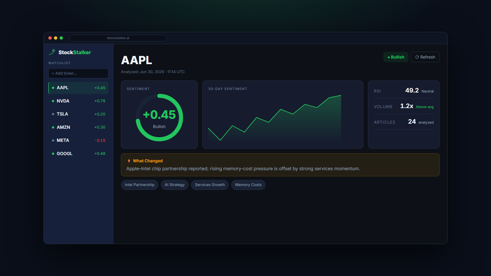

<div align="center">


# StockStalker-AI

### Multi-Agent Quantitative News Intelligence

**AI-powered multi-agent stock intelligence platform for financial news analysis, quantitative market insights, and Retrieval-Augmented Generation (RAG).**

</div>


## 🎬 Watch the Website Tour

<a href="https://youtu.be/NFoiecE-uYs?si=tLaJnazA-xBl4AEt">
  
</a>

*`docs/website-tour.mp4` — a 40-second animated walkthrough (dashboard, the multi-agent pipeline, and integrations), rendered with Remotion.*

## Overview

StockStalker-AI transforms a simple watchlist into structured, explainable trading intelligence.

For every ticker, the platform concurrently collects financial news from multiple trusted sources, retrieves historical context using persistent vector memory, performs quantitative market analysis, and synthesizes everything through specialized AI agents into a comprehensive trading report.

Unlike traditional stock news summarizers, StockStalker-AI combines **Multi-Agent AI**, **Retrieval-Augmented Generation (RAG)**, **Quantitative Analysis**, and **Persistent Memory** to deliver contextual investment intelligence rather than generic summaries.


## Features

Everything below is **built and working** today (✅). Planned items are in the [Roadmap](#roadmap).

**🧠 Multi-agent intelligence**
- ✅ **Memory Agent** — historical context + sentiment trend (SQL + vector RAG)
- ✅ **News Agent** — AI news selection & analysis: sentiment, key themes, "what changed", summary
- ✅ **Quant Agent** — technical signals (RSI, MACD, Bollinger Bands, volume) + market fundamentals
- ✅ **Orchestrator** — fuses memory + news + quant into one synthesized report
- ✅ Fully **async** pipeline (`asyncio.gather`); multi-ticker batches under a concurrency semaphore

**📰 Data & analysis**
- ✅ **4 concurrent news sources** — Polygon, Finviz, Yahoo Finance RSS, Google News RSS (per-source timeout + URL/title dedup)
- ✅ **Per-article sentiment + source credibility** → a credibility-weighted composite alongside the LLM aggregate
- ✅ **VADER fallback** — rule-based sentiment when the LLM is unavailable, so analysis degrades gracefully instead of failing
- ✅ **Market enrichment** — P/E, market cap, beta, 52-week range, dividend yield, earnings date, sector/industry (yfinance)
- ✅ **Vector memory / RAG** — pgvector (Supabase) or local SQLite; the system learns across runs

**🤖 LLM layer**
- ✅ **Gemini** structured output — validated Pydantic objects, no string parsing
- ✅ Provider-agnostic **LLM factory** — swap in OpenAI / Anthropic / others via config
- ✅ Retry, rate-limiting, and graceful degradation throughout

**🖥️ Interfaces**
- ✅ **Web dashboard** (Next.js + Tailwind) — sentiment & RSI gauges, charts, market card, what-changed, key themes, source articles, agent timeline, 7-day history
- ✅ **Live "analysis in progress"** screen — add a ticker, watch the agents work, results appear automatically
- ✅ **Firebase authentication**
- ✅ **CLI** — scriptable commands **and** an interactive arrow-key menu (rich + questionary)
- ✅ **REST API** (FastAPI) powering the frontend
- ✅ **Telegram bot** — `/analyze`, `/add`, `/remove`, `/watchlist`, `/summary`, `/status` + natural-language and bare-ticker, with a command menu
- ✅ **Alerts engine** — sentiment-threshold rules + daily summary pushed to Telegram
- ✅ **MCP server** — 5 tools for Claude Desktop / Cursor, mounted on the API at `/mcp` (or standalone)

**🗄️ Platform**
- ✅ **SQLAlchemy 2.0 async** — dual SQLite (dev) / PostgreSQL + pgvector (Supabase, prod); schema auto-creates
- ✅ **Daily scheduler** (APScheduler cron) — auto-refresh + summary
- ✅ **Single-process mode** (`ENABLE_BACKGROUND_JOBS`) — web + bot + scheduler in one service (free-tier friendly)
- ✅ **Deployment guide** — Render + Supabase + Firebase ([DEPLOYMENT.md](DEPLOYMENT.md))

## Architecture

```
┌──────────────────────────────────────────────────────────────────────┐
│  DATA SOURCES                                                          │
│  Polygon API  ·  Finviz  ·  Yahoo Finance RSS  ·  Google News RSS    │
└───────────────────────────────┬──────────────────────────────────────┘
                                 │  (4 sources, concurrent)
                                 ▼
┌──────────────────────────────────────────────────────────────────────┐
│  ASYNC SCRAPER ORCHESTRATOR                                            │
│  BaseScraper (httpx + rate limiter) · REST APIs + RSS feeds          │
│  asyncio.gather + per-source timeout + URL/title dedup                 │
└───────────────────────────────┬──────────────────────────────────────┘
                                 │  list[Article]
                                 ▼
┌──────────────────────────────────────────────────────────────────────┐
│  AGENT LAYER  (custom BaseAgent framework)                            │
│                                                                        │
│        MemoryAgent ──► MemoryContext ──┐                              │
│                                         ├─► OrchestratorAgent ─► Synthesis
│        NewsAgent  ┐                     │       (fuses all 3)          │
│                   ├─(asyncio.gather)────┘                              │
│        QuantAgent ┘                                                    │
└───────────────────────────────┬──────────────────────────────────────┘
                                 │  TickerAnalysis (typed)
                                 ▼
┌──────────────────────────────────────────────────────────────────────┐
│  SUPPORT LAYER                                                         │
│  GeminiClient (retry/rate-limit) · provider-agnostic LLM factory      │
│  DatabaseManager (SQLAlchemy) · VectorStore (pgvector/SQLite) · log    │
└───────────────────────────────┬──────────────────────────────────────┘
                                 │  persist + index (closes RAG loop)
                                 ▼
┌──────────────────────────────────────────────────────────────────────┐
│  PIPELINE / CLI                                                        │
│  PipelineRunner (shared resources, semaphore) · DailyScheduler         │
│  CLI: interactive menu (rich + questionary)  +  scriptable commands —  │
│  analyze · add-ticker · remove-ticker · list-tickers · run-scheduler   │
└──────────────────────────────────────────────────────────────────────┘
```

## Tech Stack

| Component | Technology | Why This Choice |
|---|---|---|
| HTTP client | **httpx** | Async-native; replaces blocking `requests` so all four sources fetch concurrently. |
| News sources | **httpx + RSS** | Polygon & Finviz plus Yahoo Finance / Google News RSS feeds — all lightweight HTTP (no headless browser), each isolated with its own timeout. |
| AI validation | **Pydantic v2** | End-to-end typed pipeline — agents pass validated models, never raw dicts; bad LLM output fails loudly at the boundary. |
| Config | **pydantic-settings** | Validates secrets at startup (fail-fast with a clear message) instead of failing silently on the first API call. |
| Logging | **loguru** | Structured, colored, rotating file logs — replaces `print()` and ad-hoc logging config. |
| Vector memory | **pgvector / SQLite** | Gemini embeddings stored via pgvector in Postgres (Supabase) for prod, or a local SQLite fallback in dev — same database as everything else, no separate vector service. |
| Async DB | **SQLAlchemy 2.0 (async)** | One async data layer over **SQLite** (dev) and **PostgreSQL/Supabase** (prod, via asyncpg); schema auto-creates on first boot. |
| Agent framework | **Custom (`BaseAgent`)** | ~100 lines of explicit, inspectable agent internals (timing, logging, error capture) vs. the opaque magic of CrewAI/AutoGen. |
| LLM | **Gemini 2.5 Flash Lite** | Structured output (validated objects, no string parsing), strong quality, generous free tier; pluggable via a provider-agnostic factory (OpenAI/Anthropic/etc.). |
| Concurrency | **asyncio.gather** | 4 sources scraped concurrently (~3-4s) instead of sequentially; multiple tickers analyzed under a semaphore. |
| Interactive CLI | **rich + questionary** | Colored panels/tables/spinners plus an arrow-key menu, so the tool is pleasant to use interactively (`stockstalker`) as well as scriptably. |

## Design Decisions

**1. Custom agent framework over CrewAI / AutoGen.** Agent frameworks hide the control flow that matters most here — when each agent runs, what context it sees, how failures propagate. A ~100-line `BaseAgent` (an `execute()` wrapper that times the run, logs it to the DB, and converts any exception into a typed failure result that never crashes the pipeline) makes all of that explicit and debuggable. The orchestration ("memory first, then news + quant in parallel, then one synthesis call") is plain `asyncio`, not a DSL.

**2. Vector memory, not just SQL history.** SQL can tell you *that* a ticker was analyzed before; it can't tell you *which past events resemble today's news*. The Memory Agent embeds prior articles (Gemini embeddings) into **pgvector on Supabase** — or a local SQLite store in dev — and retrieves the semantically closest ones, so the synthesis can say "this echoes the supply-chain concern from last week." SQL still stores the structured analyses (for the sentiment-trend and recency signals); the two are complementary.

**3. All scrapers concurrent with `asyncio.gather`.** The four sources are independent I/O-bound calls, so running them sequentially just adds their latencies. `gather` overlaps them, and each is wrapped in an isolated task with its own timeout — one slow or blocked source (e.g. a 403'd Finviz request) can't abort the others or blow the latency budget.

**4. Pydantic for everything.** Every boundary — a scraped `Article`, an agent's `AgentResult`, the final `TickerAnalysis` — is a validated Pydantic model. This means an agent literally cannot pass a malformed object downstream, the LLM's structured output is validated on arrival, and the whole pipeline is autocomplete-friendly and self-documenting. Typing the pipeline end-to-end turns a class of silent runtime bugs into loud, located errors.

**5. `generate_structured()` instead of prompt-parsing hacks.** Rather than asking the model for JSON and then regex-stripping markdown fences and `json.loads`-ing the result (brittle, and a frequent source of production failures), the LLM client uses structured output (`with_structured_output(schema)` over the provider factory, backed by Gemini's response-schema support). The model returns a *validated Pydantic instance directly* — there is no string parsing anywhere in the pipeline.

## Quick Start

```bash
# 1. Clone
git clone <repo-url> && cd stock-news-summarizer

# 2. Install (editable, with dev/test extras) into a Python 3.12 venv
pip install -e ".[dev]"

# 3. Configure secrets
cp .env.example .env            # then fill in GEMINI_API_KEY and POLYGON_API_KEY

# 4. Launch the interactive menu...
stockstalker

#    ...or run a one-off command directly
stockstalker analyze AAPL
```

## CLI Reference

After `pip install -e .`, the `stockstalker` command is available. Run it **with no arguments to launch the interactive menu**, or pass a subcommand to run it directly (ideal for scripts and cron):

```bash
stockstalker                       # interactive arrow-key menu
stockstalker <command> [args]      # one-off command (= python stockstalker/main.py <command> [args])
```

### Interactive menu

Running `stockstalker` with no arguments opens an arrow-key menu (built with **rich** + **questionary**). Pick an action, answer the prompt, and results render in colored panels — then it loops back to the menu.

```
 StockStalker v2 · Multi-agent quantitative news intelligence

 ? What would you like to do?  (use the up/down arrows, then Enter)
 > Analyze ticker(s)
   Add ticker to watchlist
   List watchlist
   Remove ticker
   Run daily scheduler
   Exit
```

> **Note:** the interactive menu needs a real terminal — **PowerShell, cmd, or Windows Terminal**. It does not run inside Git Bash/MinTTY or through a pipe (a `prompt_toolkit` limitation); use the direct commands below in those environments.

### Commands

**`analyze TICKERS...`** — run the full pipeline for one or more tickers.
```
$ stockstalker analyze AAPL
────────────────────────────────────────────────────────────
TICKER: AAPL  |  2026-06-23 06:01
Sentiment: +0.30  |  Days of History: 1
Themes: Intel-Apple Chip Collaboration, Rising Memory Chip Costs, AI Strategy, ...

WHAT CHANGED:
The primary new development is the reported agreement between Apple and Intel ...

SYNTHESIS:
Apple's stock is currently influenced by a confluence of strategic advancements
and immediate cost pressures ... a bearish MACD crossover ... For a trader
monitoring AAPL, the key takeaway is to watch for confirmation of the Intel
partnership ...

SIGNALS: RSI=49.25  MACD=1.20  Vol Ratio=0.85
────────────────────────────────────────────────────────────
```

**`add-ticker SYMBOL`** — add a ticker to the watchlist.
```
$ stockstalker add-ticker NVDA
Added NVDA to watchlist
```

**`remove-ticker SYMBOL`** — remove (soft-delete) a ticker from the watchlist.
```
$ stockstalker remove-ticker NVDA
Removed NVDA from watchlist
```

**`list-tickers`** — show active tickers and when each was last analyzed.
```
$ stockstalker list-tickers
Active tickers:
  AAPL  (last analyzed: 2026-06-23 06:08)
```

**`run-scheduler`** — analyze the whole watchlist now, then start the daily cron refresh.
```
$ stockstalker run-scheduler
Running initial analysis for 3 tickers before starting scheduler...
Scheduler running. Daily refresh at 08:00 Asia/Kolkata
Press Ctrl+C to stop.
```

**`api`** — start the FastAPI server (port 8000) that powers the web frontend.
```
$ stockstalker api
INFO:     Uvicorn running on http://0.0.0.0:8000
```

**`mcp-server`** — start the MCP server so MCP clients (e.g. Claude Desktop) can call StockStalker as tools.
```
$ stockstalker mcp-server
Starting StockStalker MCP server...
Connect Claude Desktop at: http://127.0.0.1:8765/mcp
```

## Web UI & Integrations

Beyond the CLI, StockStalker ships with:

- **Web frontend** (`frontend/`) — a Next.js + Tailwind dashboard (watchlist, per-ticker analysis, history, alerts, MCP status). Start the backend with `stockstalker api`, then `cd frontend && npm install && npm run dev` (→ http://localhost:3000).
- **Telegram alerts** — rule-based notifications (sentiment thresholds, daily summaries) delivered to Telegram; configured from the dashboard or via `TELEGRAM_BOT_TOKEN` in `.env`.
- **MCP server** — exposes the engine to MCP clients (Claude Desktop, Cursor, IDEs) as five tools (`get_stock_analysis`, `run_stock_analysis`, `get_watchlist`, `compare_tickers`, `get_system_status`). **Mounted on the API at `/mcp`** by default (single service), or run standalone with `stockstalker mcp-server`.

## Performance

Measured on live runs (free-tier Gemini, single developer machine):

| Operation | Time | Notes |
|---|---|---|
| Scraping (4 sources, concurrent) | **~3-4s** / ticker | Polygon + Finviz + Yahoo & Google News RSS (~90 articles for AAPL); all HTTP, no headless browser. |
| Full single-ticker analysis | **~32s** | Scrape → memory → news + quant → synthesis → persist. |
| 3-ticker concurrent batch | **~58s** | vs. ~96s if run sequentially → **~40% faster**. Not 3× because the shared LLM rate limiter (0.9 calls/s) serializes the model calls; the scrapes overlap fully. |

Cross-run memory is verified end-to-end: a second analysis of the same ticker reports `Days of History: 1` and retrieves the prior run's indexed articles, confirming the RAG loop.

## Deployment

The whole backend ships as a **single service** (web + REST API + Telegram bot + daily scheduler + MCP) alongside the Next.js frontend, backed by Supabase and Firebase. Full step-by-step instructions — Render + Supabase + Firebase, env vars, and a free-tier single-service setup — are in **[DEPLOYMENT.md](DEPLOYMENT.md)**.

- `ENABLE_BACKGROUND_JOBS=true` runs the Telegram bot + daily scheduler **inside the API**, so the backend is one process.
- The MCP server is mounted at `/mcp` on that same service (`ENABLE_MCP`, on by default).

## Roadmap

Planned next (the features above are already done ✅):

- 🔜 **Live deployment on a custom `.com` domain** — public, always-on hosting for the full app (frontend + API + Supabase)
- ⬜ **Always-on backend** — paid tier or an uptime pinger so the bot + scheduler never sleep on free hosting
- ⬜ **Multi-user accounts** — per-user watchlists and alert rules (today there's one shared watchlist)
- ⬜ **Price & volume alerts** — beyond sentiment thresholds
- ⬜ **More sources** — SEC EDGAR filings, the Apify financial-news-sentiment actor, social signals (X / Reddit)
- ⬜ **Backtesting & portfolio tracking** — measure how the signals would have performed; P&L view
- ⬜ **Email / scheduled digests** — a daily briefing by email alongside Telegram
- ⬜ **PWA / mobile** — installable mobile experience with push notifications
- ⬜ **CI/CD** — automated tests + lint on every push

## vs. StockStalker v1

- **Async vs. synchronous** — `asyncio` throughout (httpx, aiosqlite, concurrent scrape + multi-ticker batch) instead of blocking, one-thing-at-a-time `requests`.
- **4 sources vs. 3** — Polygon, Finviz, Yahoo Finance RSS, and Google News RSS, each isolated and individually timed (all lightweight HTTP — no headless browser).
- **Vector memory vs. SQL-only** — pgvector/Supabase RAG so each run is informed by semantically similar past events, not just a flat history table.
- **Typed pipeline vs. dict passing** — validated Pydantic models at every boundary instead of free-form dictionaries.
- **Multi-agent vs. monolithic** — specialized Memory/News/Quant agents coordinated by an orchestrator, replacing one big summarize-everything function.
- **Interactive menu + scriptable CLI** — an arrow-key TUI (rich + questionary) for exploration *and* one-off commands for scripts/cron, vs. a single web view.
- **Resilient LLM client vs. one-shot** — rate-limited, 3-retry-with-backoff structured-output client, plus a provider-agnostic factory (swap Gemini for OpenAI/Anthropic via config) instead of a single direct call.
